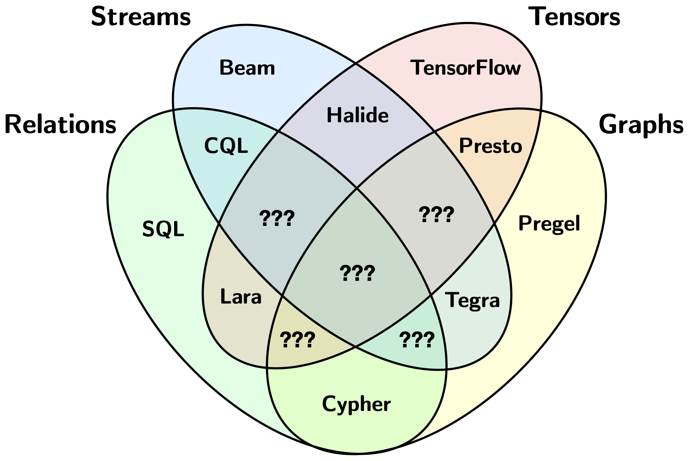

# Problem and Motivation

The vision of Arc-Script is a *language* with support processing multiple types of collections. This is in contrast to most distributed systems languages and frameworks for data analytics which only support a limited number of collection types.

Arc-Script's level of abstraction is lower than query-languages but higher than systems languages. In particular, Arc-Scripts can contain sequential (non-declarative) code, has pass-by-value semantics, and are able to compile into and intermix with systems languages and streaming runtimes. Additionally, Arc-Script's generality level is broader than query-languages but narrower than general-purpose languages. Like query-languages, Arc-Script programs are about programming with high-level operators and collections, but unlike query-languages, these concepts can also be naturally expressed inside Arc-Script programs. This approach gives users more flexibility and allows programs to be optimised at a finer level of granularity, while removing potential complexity introduced by systems languages. Query languages are inevitably going to be more useful for certain end-users and applications. Despite this fact, query languages can see some benefit by translating into Arc-Script code because of opportunities for optimisation.
